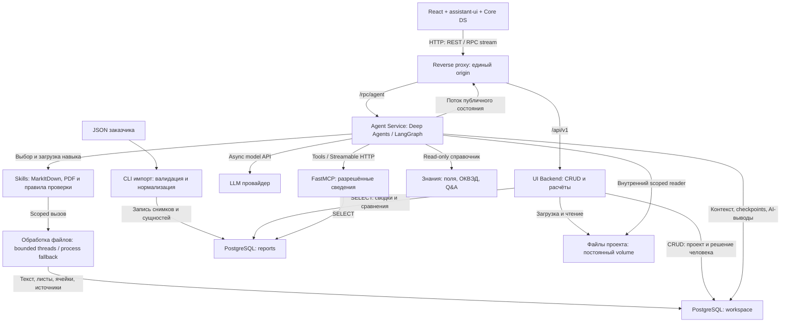

# MVP: проверка контрагентов с агентом

Версия 1.1 · 05.09.2026 · Подробный проект ТЗ для передачи в работу.

Документ фиксирует обсуждённое решение. Наличие ТЗ не означает, что компоненты уже реализованы или проверены. Архитектурные решения пользователя отмечены как принятые; предложенные здесь рабочие значения — как defaults MVP. Проверки совместимости библиотек выполняются при реализации и не блокируют начало работ.

## Что делаем

Рабочее пространство предпринимателя, который хочет решить, сотрудничать ли с контрагентом и на каких условиях. Основная поверхность — сохраняемый разговор с агентом. Агент уточняет цель, получает сведения из отчётов, сопоставляет их с условиями сделки и документами, объясняет основания и обновляет результат после новых данных. Пользователь принимает и записывает решение.

Основной сценарий — одна компания. Сравнение 2–20 компаний доступно в той же проверке; демонстрация сравнения — на пяти. Таблица и карточки помогают разговору, не превращаются в отдельную закупочную систему.

## Из чего состоит

| Часть | Ответственность | Основной стек | Подробное ТЗ |
|---|---|---|---|
| Общая архитектура | Границы, владение данными, потоки, развёртывание | Монорепозиторий, Docker Compose | [01_ARCHITECTURE.md](01_ARCHITECTURE.md) |
| PostgreSQL и импорт | Исходный JSON, сущности отчёта, проекты и состояние | PostgreSQL, SQLAlchemy async, psycopg, Alembic | [02_DATA_AND_STORAGE.md](02_DATA_AND_STORAGE.md) |
| Backend для UI | CRUD, документы, расчёты, сводки, сравнение, источники | Python 3.13, FastAPI, Dishka, Pydantic | [03_UI_BACKEND.md](03_UI_BACKEND.md) |
| Сервис агента | Контекст, диалог, инструменты, выводы, RPC и запуск | Deep Agents, LangGraph, LangChain, assistant-stream | [04_AGENT_SERVICE.md](04_AGENT_SERVICE.md) |
| MCP | Ограниченный доступ агента к отчётам | FastMCP, Streamable HTTP | [05_MCP_SERVICE.md](05_MCP_SERVICE.md) |
| Frontend | Готовое поведение чата, состояния и продуктовые компоненты | React, TypeScript, Vite, assistant-ui, Core DS | [06_FRONTEND.md](06_FRONTEND.md) |
| Дизайн и UX | Экраны, элементы, точные тексты, переходы и адаптив | Обязательно Alfa Core Components | [07_DESIGN_AND_UX.md](07_DESIGN_AND_UX.md) |
| Разработка и приёмка | Асинхронность, типизация, тесты, этапы и проверки | pytest, Ruff, strict mypy, frontend checks | [08_ENGINEERING_AND_ACCEPTANCE.md](08_ENGINEERING_AND_ACCEPTANCE.md) |
| Skills и документы | Готовые навыки, библиотеки, trace и выполнение | Deep Agents Skills, MarkItDown, PDF skill | [11_SKILLS_AND_DOCUMENTS.md](11_SKILLS_AND_DOCUMENTS.md) |
| Общие контракты | REST, RPC, MCP, публичное состояние, внутренние DTO | Pydantic / typed contracts | [10_SYSTEM_CONTRACTS.md](10_SYSTEM_CONTRACTS.md) |
| Решения и полнота | Что выбрали, от чего отказались, что проверить | Реестр требований и источников | [09_DECISIONS_AND_TRACEABILITY.md](09_DECISIONS_AND_TRACEABILITY.md) |

Готовый интерактивный HTML дизайнера принят как визуально-поведенческий
baseline реализации:
[`Проверка контрагентов v2.dc.html`](<../../artifacts/Design TZ для экранов/Проверка контрагентов v2.dc.html>).
Его декомпозиция и параллельный порядок работ зафиксированы в
[`../WORK_PLAN.md`](../WORK_PLAN.md). Исходный HTML и демонстрационный
`support.js` не являются frontend runtime.

**Дизайнеру достаточно передать 07_DESIGN_AND_UX.md.** Документ самостоятельный: включает продуктовую задачу, данные демо, компоненты, все основные состояния и критерии приёмки. Frontend-разработчик читает его вместе с 06. Backend-разработчик начинает с 01 и 02; AI-разработчик — с 04 и 05.

## Схема связей

Блоки UI Backend, Agent Service и FastMCP — три отдельно запускаемых Python-сервиса. Импортёр — служебная команда, справочник — версионируемый ресурс, reverse proxy — маршрутизация. Они не добавляют новых бизнес-сервисов. Ответы REST/MCP возвращаются по тому же соединению; стрелки доступа к БД обозначают запрос и ответ. LLM вызывается только backend, ключа в браузере нет.

`reports` и `workspace` — две схемы одного PostgreSQL. В `workspace` также живут служебные таблицы состояния LangGraph, при подтверждённой поддержке выбранного backend. Доступ к файлам агента всегда ограничен проектом. Общие расчёты — Python-пакет внутри монорепозитория, не четвёртый сервис.

## Ключевые зафиксированные решения

- Три backend-сервиса: UI Backend, Agent Service, MCP. Отдельный официальный LangGraph Agent Server не добавляем.
- Транспорт встроенного чата — **assistant-stream**; React-основа — **assistant-ui**. API библиотек связываем небольшими адаптерами.
- REST и RPC имеют отдельные маршруты и контракты. FastMCP использует свой штатный протокол.
- Сервис агента не хранит единственную копию истории в памяти процесса; состояние восстанавливается из PostgreSQL.
- **Закрытие страницы не отменяет агентный запуск.** Повторное подключение и отмену проверяем при реализации. Кнопка «Остановить» отменяет работу явно.
- Для MVP один экземпляр Agent Service. Продолжение после падения процесса не гарантируется автоматически: сохраняем checkpoints, отмечаем прерывание, даём продолжить. Масштабирование и durable queue — отдельный этап.
- В MVP нет доступа к банковским операциям клиента или контрагента. Контекст сделки берём из сообщений и пользовательских файлов.
- MCP внутри приложения обязателен по выбранной архитектуре. Внешнее подключение своего AI — опциональная демонстрация после основного сценария.

## Как читается набор

Имена сущностей и общие контракты определены в 01–02. Специализированный документ определяет реализацию своей части. Требования экранов определяет 07. Вопросы библиотечной совместимости и критерии завершения собраны в 08–09.

Этот набор заменяет прежние архитектурные варианты с обязательным Agent Server, AG-UI или собственным SSE-протоколом. Дизайн 07 обновляет DESIGN_BRIEF_V2; ранние материалы со сравнением как главным экраном не используются как требования к MVP.

## Потоки данных по сценариям

| Поток | Последовательность | Что передаётся / сохраняется |
|---|---|---|
| D01 Импорт | JSON → CLI → reports | Batch/hash → raw snapshot → компании, финансы и прочие сущности; lineage/source paths. Повторный импорт идемпотентен |
| D02 Начало проверки | UI → REST → workspace → UI → RPC → Agent Service | Project/session ID и первая команда; банковский отчёт не копируется целиком в каждый проект |
| D03 Ответ и уточнение | Agent Service → checkpoint/context → MCP → reports → агент → LLM → assistant-stream → UI | Подтверждённые условия, нужные факты с refs, публичный ответ, действия и trace навыка; вопросы и результат сохраняются |
| D04 Документ | UI → REST upload → files + workspace → scoped reader агента | Оригинал, extracted fragments, status, provenance; контекстный вопрос связывается с документом |
| D05 Детерминированная карточка | UI → REST → reports/shared calculations → UI | Цифры, периоды, исходные оценки, доступность; LLM не вызывается |
| D06 Сравнение | UI → REST comparison → reports + workspace → UI; при обсуждении → Agent Service → MCP | Сопоставимые отчётные показатели + отдельно условия КП; два источника имеют собственные refs |
| D07 Решение человека | UI → REST decisions → workspace | Автор, вариант, условия, версии оснований; AI не подтверждает решение за пользователя |
| D08 Возврат после ухода | UI → сохранённая conversation view → subscribe активного run | Уход не отменяет задачу; возвращение не отправляет исходное сообщение повторно |
| D09 Новые сведения | Новый документ/условие → context_version++ → outdated marker → reanalyze | Предыдущий вывод/решение сохраняются; новая версия имеет новые основания |
| D10 Явная остановка | UI → RPC cancel → RunManager → graph/tool cancellation | Partial state и cancelled status; отличается от отключения подписки |

Чтение reports агентом проходит через MCP. Чтение своих документов/условий — через внутренние инструменты проекта. UI Backend и MCP используют одни расчёты. Стриминг передаёт только публичную проекцию, а не полный контекст агента. Внешний AI/MCP — опциональная ветка с отдельным whitelist и авторизацией, см. 05.

## Какие данные и что ещё не доказано

В исходном JSON 100 снимков, финансы есть у 67 компаний, лицензии у 9, ведомственные проверки у 30. Ни финансовые остатки за отчётный год, ни открытые сведения о контрагентах не означают доступ к их текущим счетам. Детальная нормализация — 02, единые DTO — 10.

Ценность продукта — помочь закрыть конкретный вопрос с учётом сделки и имеющихся оснований, сохранить работу и продолжить её при новых сведениях. Влияние на повторное использование проверки, продление подписки и перенос операций в Альфу остаётся тремя отдельными гипотезами; показатели и способы проверки приведены в 08. Пользовательские интервью недоступны, их результаты не выдумываются.

## Дополнение 1.1: чаты, skills, документы и follow-up

- В проекте несколько сохраняемых чатов/сессий. На UI «Чаты», в API canonical `thread_id`; `session_id` — смысловой синоним, не вторая сущность. Auth-сессия отдельно.
- Материалы и подтверждённые условия общие для проекта; история сообщений и checkpoint каждого чата отдельные. Артефакт можно прикрепить к сообщению с конкретной версией.
- Анализ загруженных документов выполняется через skills. Готовые навыки и первичные источники перечислены в 11; это инструкции для исполнения разрешённых инструментов, не новый микросервис.
- XLSX, DOCX, CSV/TSV, Markdown, HTML, JSON/XML добавляются к PDF/изображениям/TXT. Старый DOC/ODT/RTF — через изолированный конвертер, с честным статусом доступности.
- Пользователь может отправить follow-up, пока агент ждёт инструмент. Команда сразу сохраняется, применяется на следующей безопасной границе перед моделью, не запускает второго исполнителя того же чата.
- В trace видна строка «Использую навык …», источник и результат. Это событие действительного вызова, а не декоративная реплика модели.

Дополнительные потоки: D11 — UI → REST sessions → выбранный thread/checkpoint; D12 — artifact version → attachment → RPC → контекст текущего thread; D13 — follow-up → persistent pending command → safe boundary → model → applied acknowledgement; D14 — agent → skill → scoped parser → fragments/artifact → trace и UI. Основной приоритет остаётся поведением агента; новые возможности не требуют отдельной панели управления системой.
